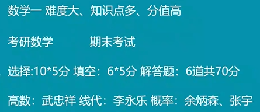
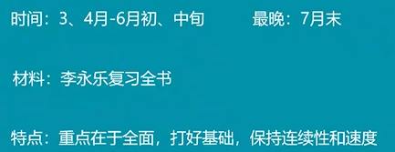
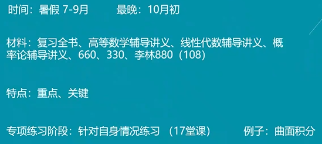
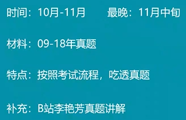
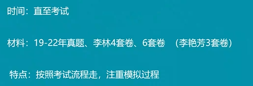
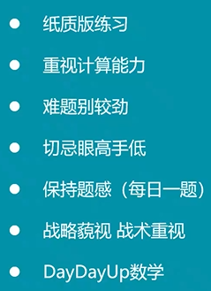
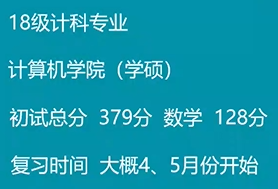
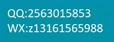

[TOC]

# 1、数学125学长分享

## 科目介绍

## 时间规划

## 复习建议

## 北邮学长联系方式

# 2、数学131学长分享

## 个人感受

## 时间规划

## 复习建议

辅导讲义>习题册

## 北邮学长联系方式

# 3、数学128学长分享

## 个人感受

数学成绩决定了是否能上岸

考研数学是选拔性考试，题目更难

线代概率不能丢分

## 时间规划+复习建议

### ①基础阶段

连续性：不要三天打鱼两天晒网

速度：可以快一点。不要影响强化阶段的冲刺和速度

做好“张宇30讲”的基础例题题即可

1000题错了的留到强化做也没有关系

### ②强化阶段（重点）

330、108：比较综合。做模拟题前可以先做这个

专项练习：对自己薄弱的地方特别训练

### ③真题阶段

### ④模拟阶段

### ⑤补充说明

纸质版：贴近于真实考试

每天数学不要停，学长两天一套模拟卷

搜索方式`DayDayUp数学`

遗忘很正常，多练习多做题就行

强化时平衡好看视频和做题

## 北邮学长联系方式

